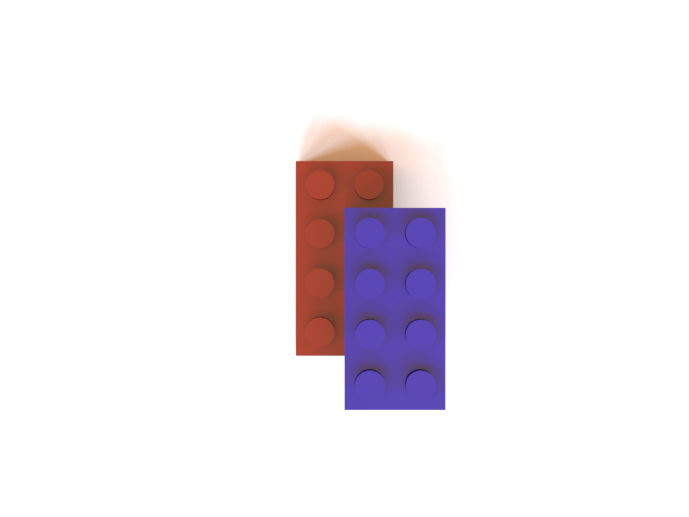
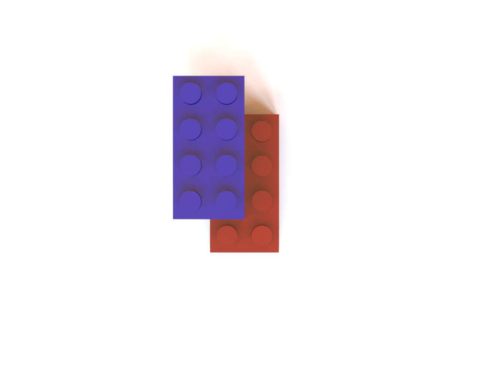
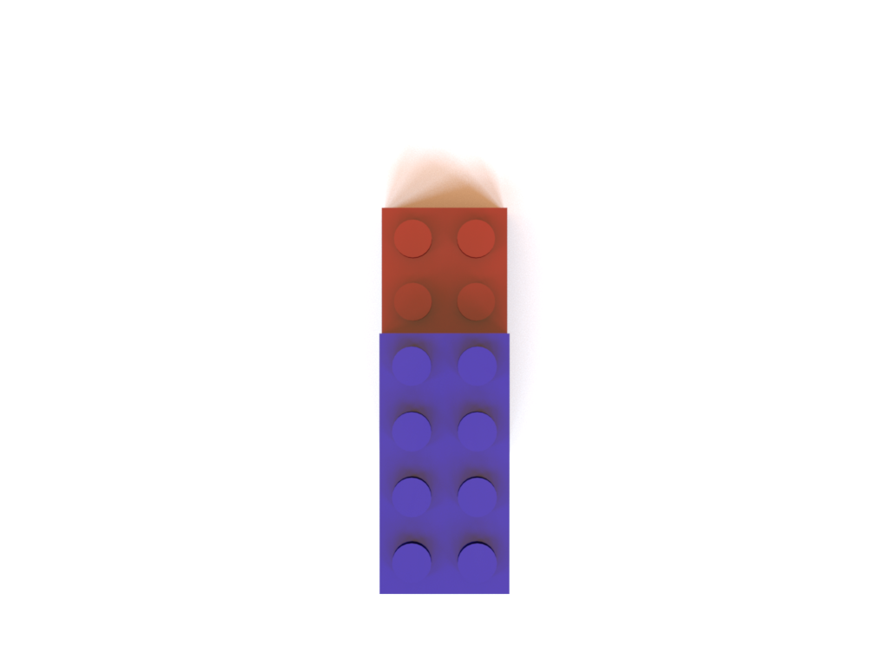
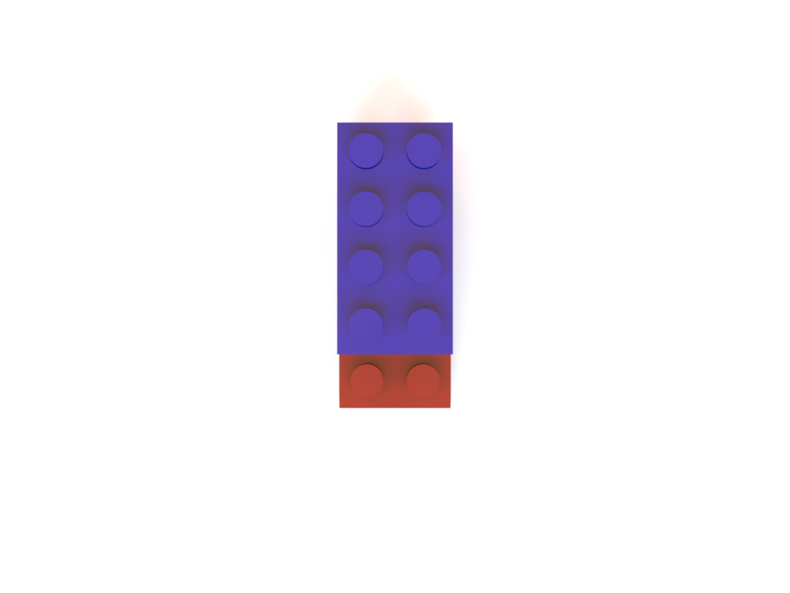
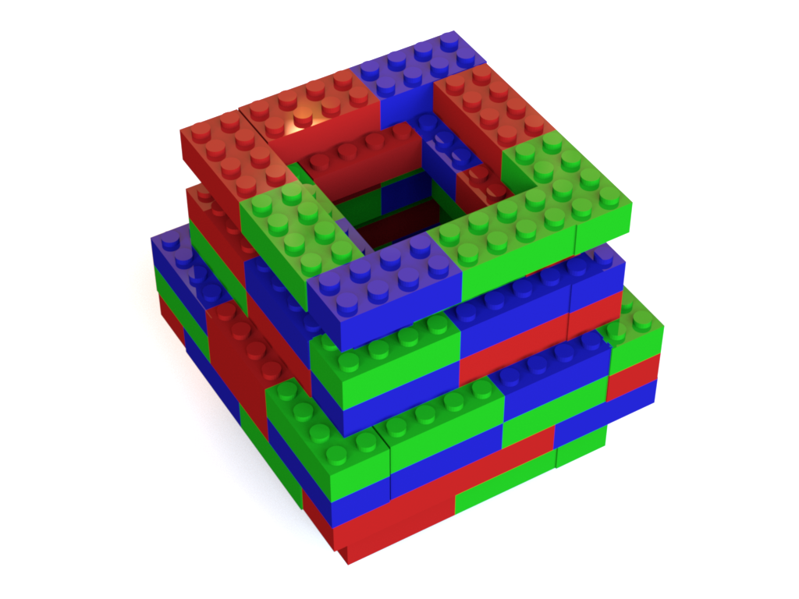
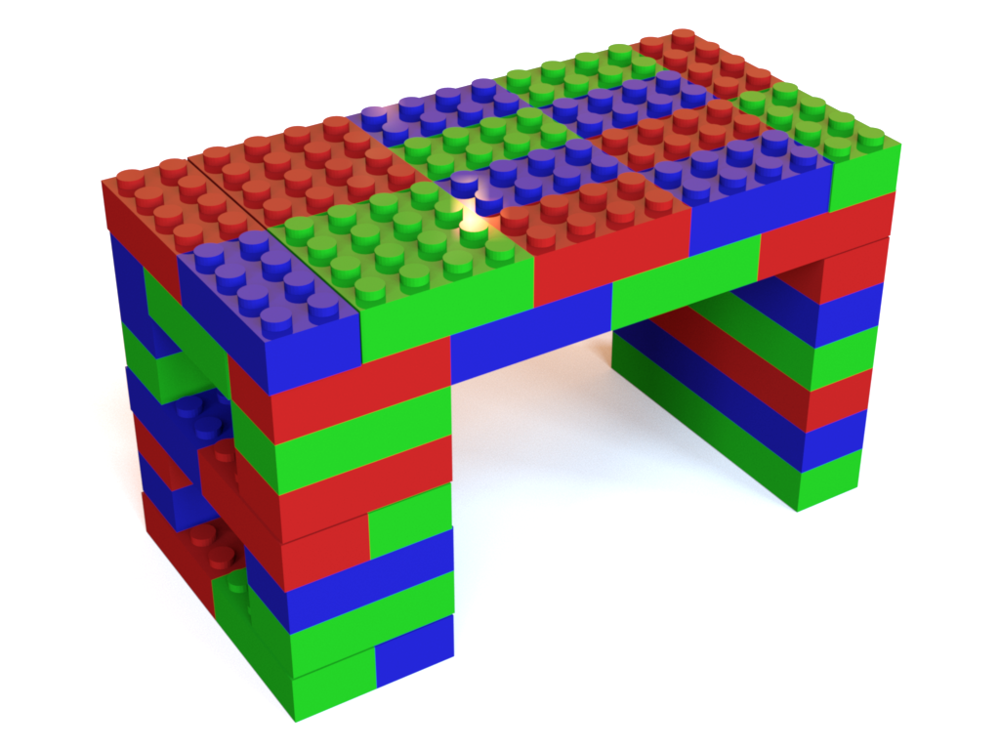

# Combinatorial-3D-Shape-Generation

* arXiv Preprint: [(abs)](https://arxiv.org/abs/2004.07414), [(pdf)](https://arxiv.org/pdf/2004.07414.pdf)

## Required Python Packages

You are able to install required Python packages by commanding `pip install -r requirements.txt`.

## Connection Types Between Two 2-by-4 Bricks

<p align="center">












</p>

## Examples in Combinatorial 3D Shape Dataset

* Bar
<p align="center">


</p>

* Line
<p align="center">


</p>

* Plate
<p align="center">


</p>

* Wall
<p align="center">


</p>

* Cuboid
<p align="center">


</p>

* Square Pyramid
<p align="center">


</p>

* Chair
<p align="center">


</p>

* Sofa
<p align="center">


</p>

* Cup
<p align="center">


</p>

* Hollow
<p align="center">



</p>

* Table
<p align="center">



</p>

* Car
<p align="center">


</p>

## Citation
```
@article{KimJ2020arxiv,
    author={Kim, Jungtaek and Chung, Hyunsoo and Lee, Jinhwi and Cho, Minsu and Park, Jaesik},
    title={Combinatorial {3D} Shape Generation via Sequential Assembly},
    journal={{arXiv} preprint {arXiv}:2004.07414},
    year={2020}
}
```

## Contact
* Jungtaek Kim: [jtkim@postech.ac.kr](mailto:jtkim@postech.ac.kr)

## License
[MIT License](LICENSE)
