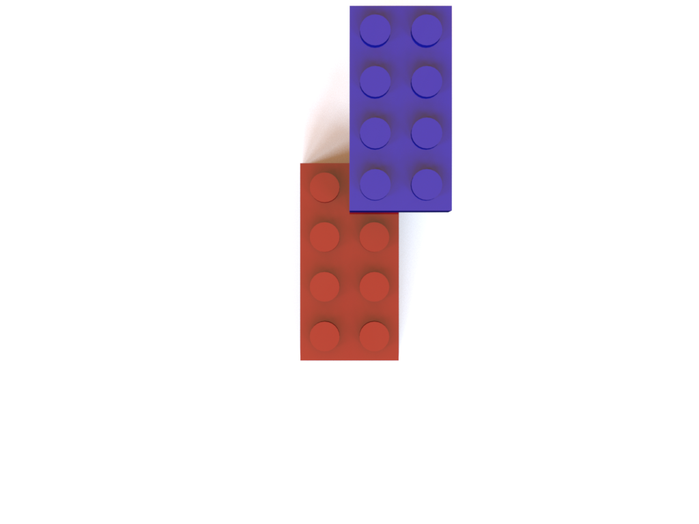
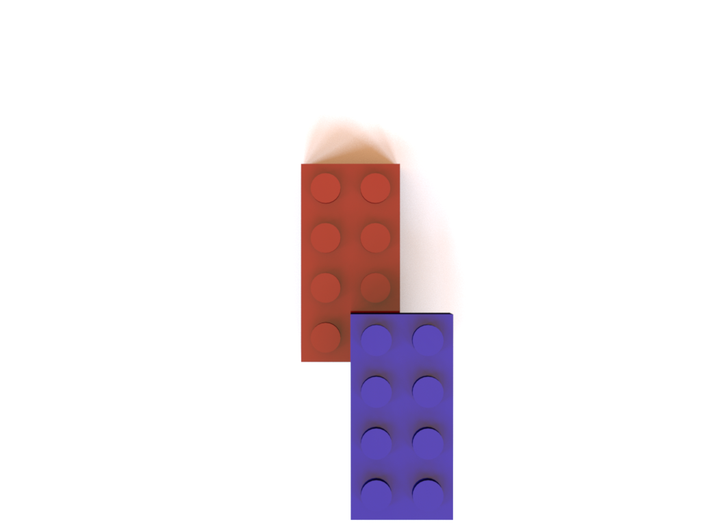
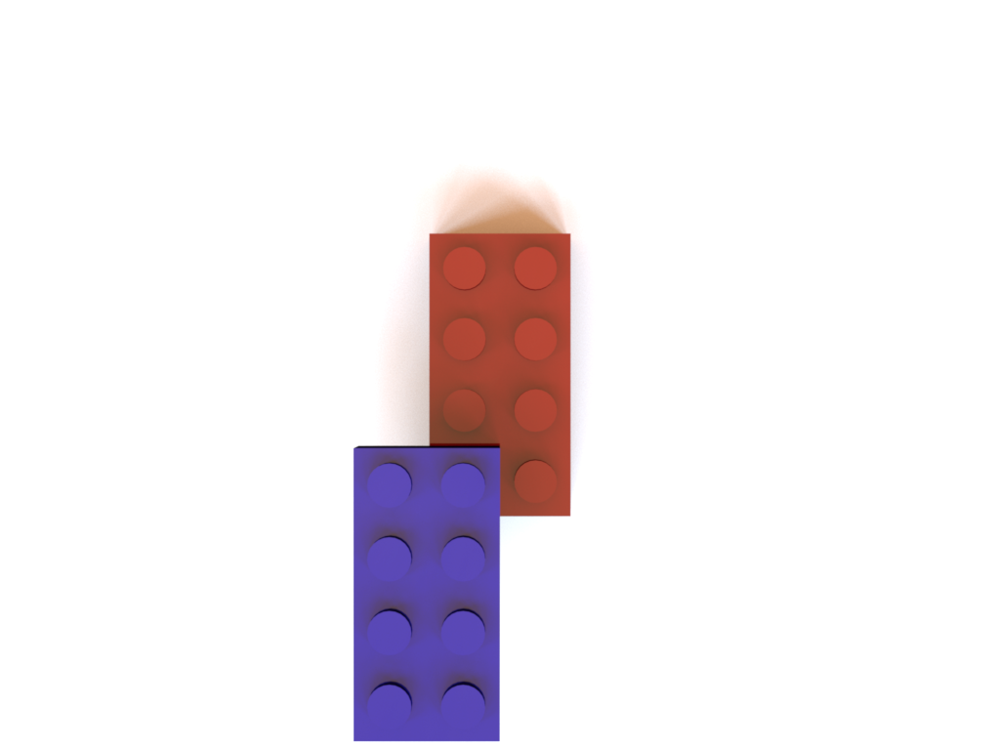
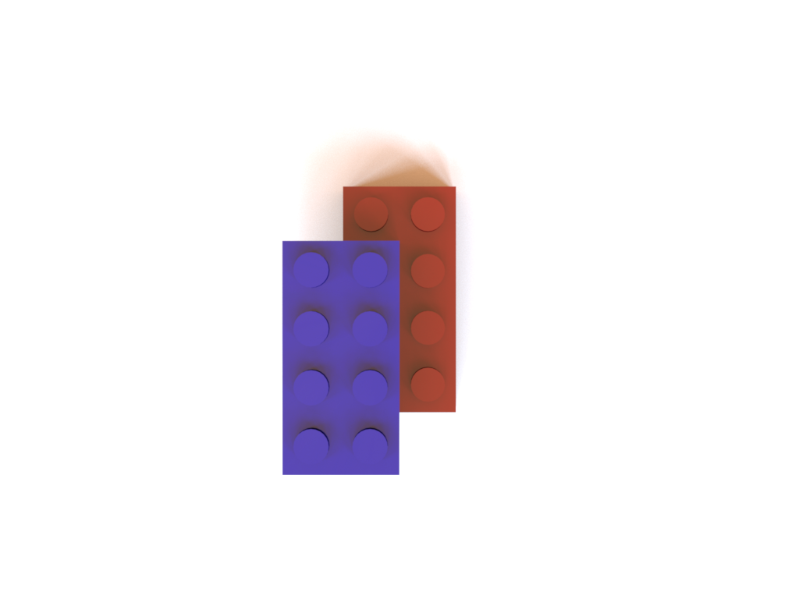
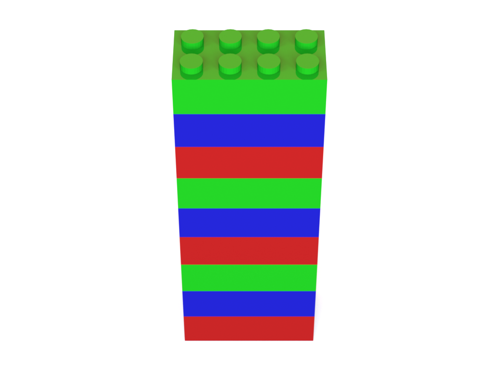

# Combinatorial-3D-Shape-Generation

## Connection Types Between Two 2-by-4 Bricks

<p align="center">









</p>

## Examples in Combinatorial 3D Shape Dataset

* Bar
<p align="center">





</p>

* Line

## Citation
```
@article{KimJ2020arxiv,
    author={Kim, Jungtaek and Chung, Hyunsoo and Lee, Jinhwi and Cho, Minsu and Park, Jaesik},
    title={Combinatorial {3D} Shape Generation via Sequential Assembly},
    journal={{arXiv} preprint {arXiv}:2004.07414},
    year={2020}
}
```

## Contact
* Jungtaek Kim: [jtkim@postech.ac.kr](mailto:jtkim@postech.ac.kr)

## License
[MIT License](LICENSE)
